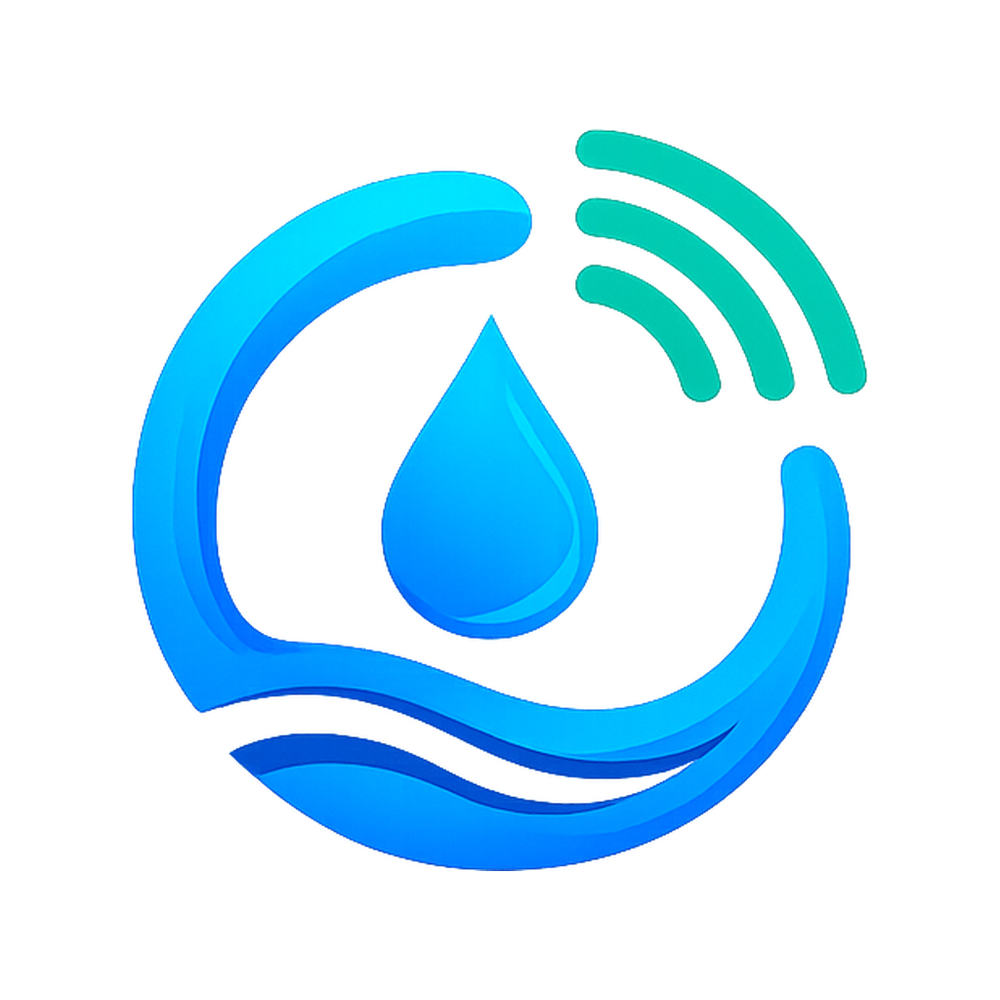
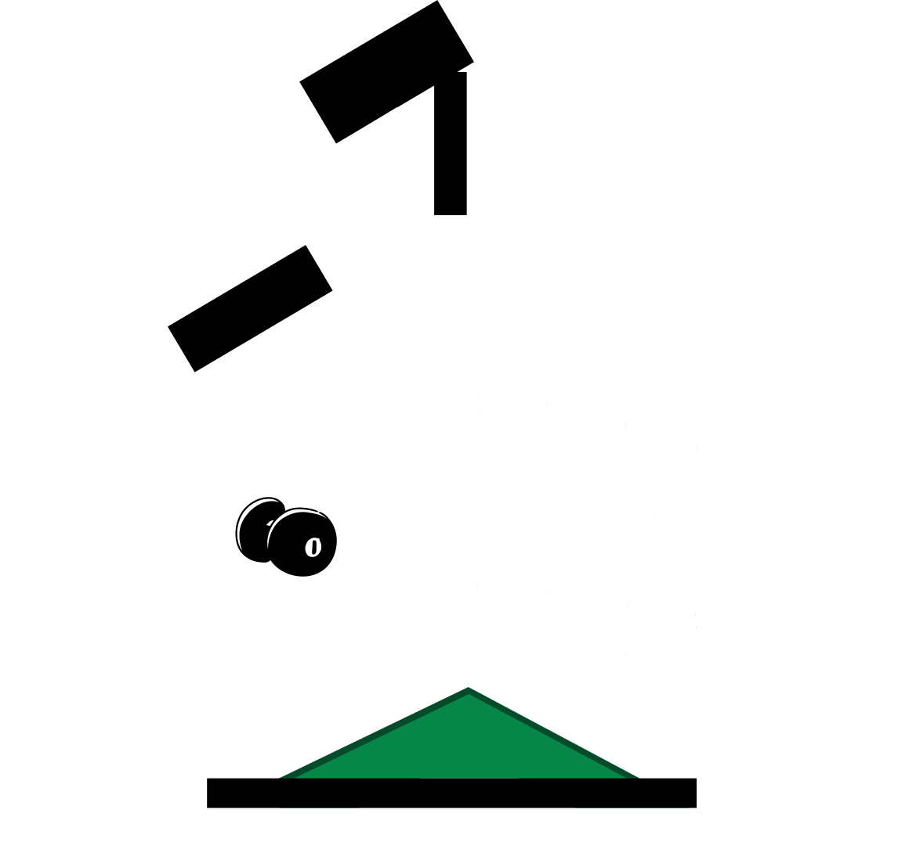
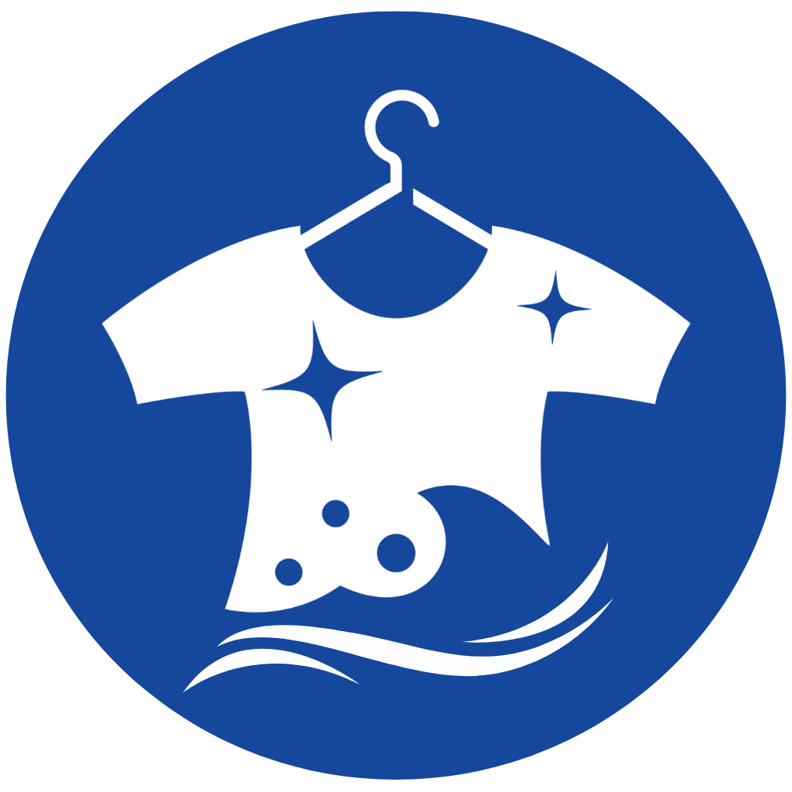

# Mark Alvin Cadangin

### Software Development Technologies · West Visayas State University

I am a 3rd-year BSIT student from Leon, Iloilo, Philippines, majoring in Software Development Technologies. I build full-stack web applications, database architectures, and connected hardware projects to solve operational problems.

 

| Field | Detail |
| :--- | :--- |
| **Degree** | 3rd-Year BSIT — Major in Software Development Technologies |
| **University** | West Visayas State University (2024 – Present) |
| **Scholarship** | DOST-SEI Scholar · Batch 2024 (Department of Science and Technology) |
| **Academic Honors** | CICT Parangal Gold Medalist (1st Year) · Silver Medalist (2nd Year) |
| **Location** | Leon, Iloilo, Philippines |
| **Status** | Open to Full-Stack Software Engineering internships & technical collaborations |
| **Portfolio** | [markcadangin.me](https://markcadangin.me) |

---

## Featured Engineering Projects

###  [SmartFlow — Residential IoT Water-Pump Controller](https://github.com/markalvincadangin/smart-water-pump-controller)

> A residential deep-well pump and water-tank automation system designed, built, and installed in Leon, Iloilo to prevent motor dry-run burnouts and eliminate daily manual monitoring. An operating hardware installation at one residential site.

- **Two-Node Wired Architecture**: An ESP32 master at the pump and an ESP8266 node at the elevated 660L tank communicate over a 40-meter CAT6 RS-485 link with CRC validation to eliminate motor electrical noise.
- **Local Firmware Safety Limits**: All critical shutdown logic (15-second dry-run lockout, 45-minute continuous run ceiling, and communication heartbeat loss) runs directly on the ESP32 with an industrial CJX2 contactor and snubber circuits, ensuring safe shutdown even when Wi-Fi is disconnected.
- **Native Android App**: Built with Kotlin and Jetpack Compose for Bluetooth setup, real-time tank level telemetry, manual motor override, and operational history.

---

###  [CONVERA — Research & Project Proposal Validation Platform](https://github.com/markalvincadangin/CONVERA)

> A full-stack research engineering tool helping student researchers and developers organize problem interviews, scholarly citations, and technical requirements into structured proposals before writing code.

- **Dual Validation Workflows**: Guides project concepts through two pathways: a 7-phase startup discovery process (Mom Test customer interviews, problem screening, MVP scoping) and an 8-stage academic research framework (literature grounding, gap analysis, DSR artifact formulation).
- **Deterministic Evaluation**: Ranks problem opportunities using explicit mathematical formulas and rubric criteria rather than generative LLM prompts, verified by 338 automated backend tests.
- **Evidence Traceability & Tool Integrations**: Visualizes linkage from research papers and customer interview notes down to concrete software requirements. Exports directly to Notion, Zotero (BibTeX / CSL-JSON), and GitHub Issues.

---

###  [HavenStay BHMS — Bed-Level Property Management Platform](https://github.com/markalvincadangin/havenstay)

> Information Management coursework prototype modeled on student boarding houses near universities, designed around individual bed-space vacancies, shared utility billing, and database-level auditability.

- **Bed-Level Occupancy & Billing**: Tracks individual bed reservations, security deposits, and prorated utility calculations across shared electric and water sub-meters.
- **45 MySQL Database Triggers**: Automatically records before-and-after snapshots directly in the database whenever room assignments or balances mutate, ensuring audit trails cannot be bypassed by application-level bugs.
- **Primary-Replica Topology**: Separates daily transactional writes from monthly billing reports using MySQL 8.4 replication orchestrated with Docker Compose.

---

###  [Faith Laundry Shop LMS — Business Management & Order Tracking](https://github.com/markalvincadangin/laundry-shop-management-system)

> A Systems Analysis and Design capstone based on the daily operations of Faith Laundry Shop in Iloilo, replacing handwritten notebooks with automated intake pricing, live receipt QR tracking, and offline counter resilience.

- **Weight-Based Pricing & Snapshotting**: Computes load counts from intake weight (`⌈weight ÷ 8kg⌉`) and freezes pricing rules at transaction creation so future catalog adjustments never alter historical receipts.
- **Zero-Login Public QR Tracking**: Customers scan the QR code printed on their thermal receipt to inspect live order progress (Received → Washing → Drying → Folding → Ready for Pickup) without downloading an application or creating an account.
- **Offline-First Desktop Deployment**: Packaged with Inno Setup to automatically install PostgreSQL and run the application as a background Windows service on the shop counter PC.
- **289 Automated Tests**: 199 backend tests (JUnit 5 + Testcontainers against PostgreSQL) and 90 frontend unit/component tests (Vitest + React Testing Library).

---

###  [TriageSense — Emergency Department Intake & Triage Support](https://github.com/markalvincadangin/triagesense)

> An academic prototype for CIT 213 (Human-Computer Interaction 2), modeled on clinical intake workflows at West Visayas State University Medical Center (WVSUMC) to reduce emergency room intake delays.

- **Dual-Viewport Architecture**: Built two purpose-designed interfaces: a 5-step self-service kiosk with regional dialect support, an anatomical symptom body map, and numeric pain rating for walk-in patients, paired with a widescreen workstation for triage nurses.
- **Nurse-Controlled ESI Assessment**: Staff workstation featuring a live intake queue, nurse-controlled Emergency Severity Index (ESI) scoring, and simulated vitals telemetry (pulse, SpO2).
- **Human-Factors Design**: Tailored high-contrast touch targets and translated dialect cues to accommodate varying patient literacy levels in emergency situations.

---

## Technical Competencies

 
<b>Core Languages</b>

  

 
<b>Frontend Architecture</b>

  

 
<b>Backend Frameworks & APIs</b>

  

 
<b>Database Engines & Containerization</b>

  

 
<b>Hardware, Platforms & Tooling</b>

---

## GitHub Analytics

---

## Contact & Profiles

